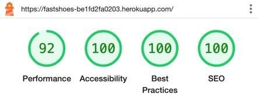
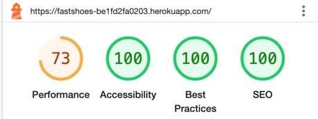
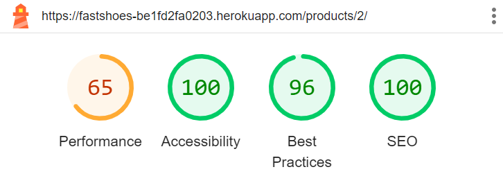
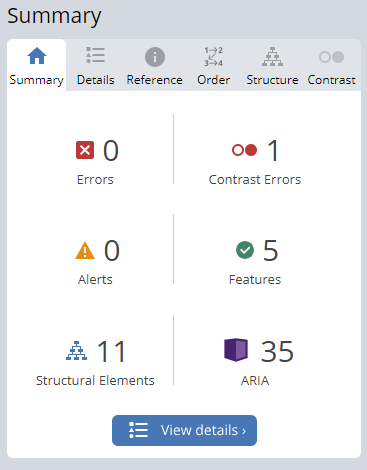
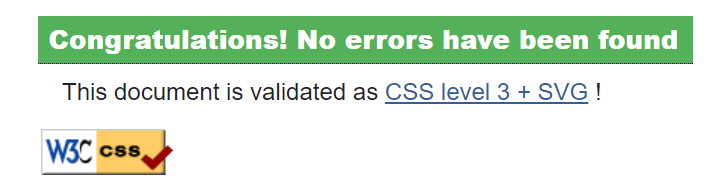
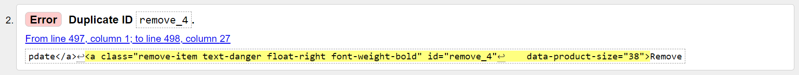
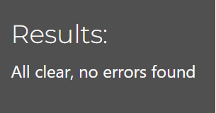
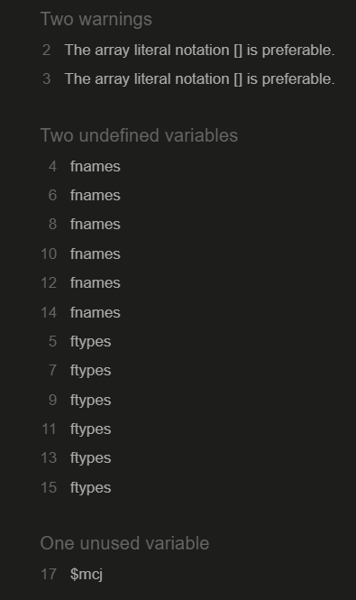
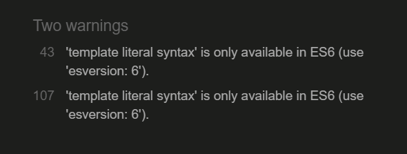

# Testing

## Contents

* [Manual Testing](#manual-testing-for-fastshoes-website)
    * [Test Case: Website Functions](#test-case-for-website-functions)
    * [Test Case: Users Functions](#test-case-for-users-functions)
    * [Test Case: Admin Functions](#test-case-for-admin-functions)
    * [Website Testing](#website-testing)
    * [Security](#section-security)
    * [Performance](#section-performance)
    * [Login Required](#section-login-required)
* [Other Tests](#other-tests)
    * [Lighthouse Test](#lighthouse-test)
    * [Wave Test](#wave)
    * [Browsers and Devices](#browsers-and-devices)
* [Validator Test](#validator-testing)
    * [CSS](#css)
    * [HTML](#html)
    * [Python Linter](#python-linter)
    * [JShint](#jshint-for-javascript)
* [Bugs Fixes and Resolutions](#bug-fixes-and-resolutions)

## Manual Testing for FastShoes Website

### Test Case For Website Functions :

| Test Case | Description                             | Status |
|-----------|-----------------------------------------|--------|
| TC-1-WF   | Verify homepage loads correctly         | Pass   |
| TC-2-WF   | Verify navigation bar functionality     | Pass   |
| TC-3-WF   | Verify product list view                | Pass   |
| TC-4-WF   | Verify product details view             | Pass   |
| TC-5-WF   | Verify adding product to cart           | Pass   |
| TC-6-WF   | Verify viewing shopping cart            | Pass   |
| TC-7-WF   | Verify updating product quantity in cart| Pass   |
| TC-8-WF   | Verify removing product from cart       | Pass   |
| TC-9-WF   | Verify checkout process                 | Pass   |
| TC-10-WF  | Verify search functionality             | Pass   |
| TC-11-WF  | Verify payment processing               | Pass   |
| TC-12-WF  | Verify responsive design on mobile      | Pass   |
| TC-13-WF  | Verify responsive design on tablet      | Pass   |
| TC-14-WF  | Verify filtering products by category   | Pass   |
| TC-15-WF  | Verify all users can use contact form   | Pass   |

### Test Case For Users Functions :

| Test Case | Description | Status |
|-----------|-------------|--------|
| TC-1-UF   | Verify that a new user can successfully create an account with valid credentials. | Pass |
| TC-2-UF   | Verify that the system displays appropriate error messages when invalid credentials are used for account creation. | Pass |
| TC-3-UF   | Verify that the system prevents the creation of duplicate accounts with the same email address. | Pass |
| TC-4-UF   | Verify that a logged-in user can update their profile information successfully. | Pass |
| TC-5-UF   | Verify that the system displays appropriate error messages when invalid data is provided for profile updates. | Pass |
| TC-6-UF   | Verify that a user can successfully delete their account and associated data. | Pass |
| TC-7-UF   | Verify that the system prompts for confirmation before deleting the account. | Pass |
| TC-8-UF   | Verify that a logged-in user can add products to their wishlist. | Pass |
| TC-9-UF   | Verify that a logged-in user can delete products from their wishlist. | Pass |
| TC-10-UF  | Verify that the system handles errors gracefully when adding or deleting products from the wishlist. | Pass |
| TC-11-UF  | Verify that a logged-in user can submit a review for a product. | Pass |
| TC-12-UF  | Verify that a logged-in user can update their existing review for a product. | Pass |
| TC-13-UF  | Verify that a logged-in user can delete their review for a product. | Pass |

### Test Case For Admin Functions :

#### Adding a Product (FRONT-END and ADMIN-PANEL)

| Test Case | Description                                             | Status |
|-----------|---------------------------------------------------------|--------|
| TC-ADM-01 | Verify that the admin can access the "Add Product" page. | Pass   |
| TC-ADM-02 | Verify that all required fields are displayed on the form. | Pass   |
| TC-ADM-03 | Verify that the admin can successfully add a new product. | Pass   |
| TC-ADM-04 | Verify that appropriate error messages are displayed if the form is not filled correctly. | Pass |

#### Updating a Product (FRONT-END and ADMIN-PANEL)

| Test Case | Description                                             | Status |
|-----------|---------------------------------------------------------|--------|
| TC-ADM-05 | Verify that the admin can access the "Update Product" page. | Pass   |
| TC-ADM-06 | Verify that the existing product details are pre-filled in the form. | Pass   |
| TC-ADM-07 | Verify that the admin can successfully update a product. | Pass   |
| TC-ADM-08 | Verify that appropriate error messages are displayed if the form is not filled correctly. | Pass |

#### Deleting a Product (FRONT-END and ADMIN-PANEL)

| Test Case | Description                                             | Status |
|-----------|---------------------------------------------------------|--------|
| TC-ADM-09 | Verify that the admin can delete a product.             | Pass   |
| TC-ADM-10 | Verify that the product is successfully deleted when the delete button is clicked. | Pass |

#### Managing Orders (ADMIN-PANEL)

| Test Case | Description                                             | Status |
|-----------|---------------------------------------------------------|--------|
| TC-ADM-12 | Verify that the admin can access the orders section.   | Pass   |
| TC-ADM-13 | Verify that the admin can view all orders.             | Pass   |
| TC-ADM-15 | Verify that the admin can delete an order.             | Pass   |

#### Managing Users (ADMIN-PANEL)

| Test Case | Description                                             | Status |
|-----------|---------------------------------------------------------|--------|
| TC-ADM-16 | Verify that the admin can access the users section.    | Pass   |
| TC-ADM-17 | Verify that the admin can view all users.              | Pass   |
| TC-ADM-18 | Verify that the admin can edit user details.           | Pass   |
| TC-ADM-19 | Verify that the admin can delete a user.               | Pass   |

#### Managing Contact Mails (ADMIN-PANEL)

| Test Case | Description                                             | Status |
|-----------|---------------------------------------------------------|--------|
| TC-ADM-20 | Verify that the admin can access the contact mails section. | Pass |
| TC-ADM-21 | Verify that the admin can view all contact mails.      | Pass   |
| TC-ADM-23 | Verify that the admin can delete contact mails.        | Pass   |

#### Managing Reviews (ADMIN-PANEL)

| Test Case | Description                                             | Status |
|-----------|---------------------------------------------------------|--------|
| TC-ADM-24 | Verify that the admin can access the reviews section.  | Pass   |
| TC-ADM-25 | Verify that the admin can view all reviews.            | Pass   |
| TC-ADM-26 | Verify that the admin can delete a review.             | Pass   |

### Website Testing

#### Section: Responsiveness

| Test Case | Objective | Steps to Reproduce | Expected Outcome |
|-----------|-----------|--------------------|------------------|
| Mobile Device Compatibility | Verify proper display and functionality of the website on mobile devices. | Access the website using a mobile device or enable mobile view in a web browser. | The website content should adapt seamlessly to smaller screens, ensuring all features are accessible and usable. |
| Tablet Device Compatibility | Confirm the website's responsiveness on tablet devices. | Access the website using a tablet device or simulate a tablet view in a web browser. | The website content should adjust correctly to the tablet screen size, with all functionalities working as intended. |

#### Section: Security

| Test Case | Objective | Steps to Reproduce | Expected Outcome |
|-----------|-----------|--------------------|------------------|
| SSL Certificate Validation | Ensure the website is served over HTTPS and the SSL certificate is valid. | Check that the website URL begins with "https://" and verify the browser's security icon. | The website should use HTTPS, and the browser should indicate a secure connection. |
| Input Validation and Sanitization | Validate input fields to prevent common web vulnerabilities like SQL injection and XSS. | Attempt to enter malicious code snippets into form inputs and URLs. | The application should reject or sanitize input to prevent execution of malicious code. |

#### Section: Performance

| Test Case | Objective | Steps to Reproduce | Expected Outcome |
|-----------|-----------|--------------------|------------------|
| Page Load Speed | Evaluate the loading speed of website pages. | Use tools like Google PageSpeed Insights to analyze load times. | Pages should load within an acceptable time frame according to web performance best practices. |
| Stress Testing | Assess website performance under heavy load. | Employ load testing tools to simulate concurrent user access. | The website should maintain responsiveness and functionality under simulated stress conditions. |

This manual testing guide is designed to comprehensively assess the essential functionalities of the FastShoes website, guaranteeing a smooth and secure user experience. Testers are urged to document any deviations encountered from the anticipated results, as outlined in the reporting section. Continuous testing and refinement play a vital role in upholding the quality and dependability of the FastShoes online platform.

#### Section: Login Required

This test was crucial to ensuring that only authenticated users could access certain pages, such as the wishlist and profile pages.

**How I tested this:**

Example of how I conducted the test:

- Employed two distinct browsers: one authenticated and one unauthenticated.
- Retrieved the URL links for the wishlist and profile pages from the authenticated browser session.
- Transferred the URLs to the browser where I was not authenticated.
- Confirmed that accessing these pages without authentication redirected me to the login page, effectively preventing unauthorized access to user-specific content.

I did this test on all user-based links.

#### Covered Tests

Below is the list of all tests that have been covered:

- Test Case: Website Functions
- Test Case: Users Functions
- Test Case: Admin Functions
- Website Testing
- Security
- Performance
- Login Required

[Back to top](#contents)

## Other Tests

### Lighthouse Test

After examining the Lighthouse scores, we noted a slightly lower performance score on mobile devices in comparison to desktop. However, extensive testing across multiple mobile devices demonstrated that the site remained responsive and functioned effectively.
Moreover, it became evident that pages restricted by the robots.txt file experienced a decrease in SEO score. The robots.txt file was identified as a significant factor contributing to this decline. For detailed results from some of the pages tested using Lighthouse, please refer below for selected Lighthouse tests.

#### Home Page

**Desktop**

**Mobile**

#### Product Page

**Desktop**

**Mobile**

#### Product View Page

**Desktop**

**Mobile**

### WAVE

I used the WAVE tool to evaluate the accessibility of my web content, and I'm satisfied with the results. On most pages, I only encountered one contrast error, except for the checkout page, where I found two. The contrast error on the checkout page is associated with the country input field and the label for the search functionality. This issue persists across all pages due to the presence of the search label in the navbar. The contrast error for the label is due to the use of the "sr-only" class, which is intended for screen readers.

On mobile and other devices, there is a single contrast error, also related to the country input field on the checkout page.

### Browsers And Devices

Tested on the following browsers:

* Google Chrome
* Safari
* Firefox

Tested on the following devices:

* Ipad Air
* Iphone 12, 13 and 14
* Samsung Galaxy

[Back to top](#contents)

## Validator Testing

### CSS

The CSS code underwent a comprehensive examination for adherence to standards and validation for errors using the W3C CSS Validation Service. Additional details about this validation service can be accessed at [W3C CSS Validator](https://jigsaw.w3.org/css-validator/). Subsequently, no errors were detected within my CSS files through direct input validation for each CSS file

### HTML

The HTML code for the project was validated using the [W3C HTML Validator.](https://validator.w3.org/nu/) All pages passed without errors except for the shopping cart page. The issue arose with the remove product link, which resulted in a duplicated ID error. This occurred because the ID changes dynamically based on the product ID, making it challenging to fix before the deadline.

### Python Linter

During the Code Institute Python Linter test, I encountered no errors in any of my Python files. However, I noticed that some of Django's built-in Python files included lines longer than 80 characters. Despite this, I chose not to modify them, as Django recommends against shortening these lines.

[Python Linter](https://pep8ci.herokuapp.com/)

### JSHint for Javascript

I ran my JavaScript code through [JSHint](https://jshint.com/) for testing. Most of the code returned without any errors or warnings. However, I encountered two instances where warnings were raised. These warnings pertained to the JavaScript code associated with Stripe and Mailchimp, which are provided below.

In the "base.html" file, a script tag for MailChimp triggered warnings due to the usage of the MailChimp API. Although I attempted to remove it completely, this caused other site features to malfunction. Consequently, I reverted the script tag to its original state. While the warnings identified by JSHint are non-critical, no changes were made to the file. You can see the warnings below.

In the checkout app's static folder, there exists a JavaScript file named "stripe_elements.js" that exhibited some warnings, as illustrated below. These warnings are non-critical, and as a result, no changes were implemented.

[Back to top](#contents)

## Bug Fixes and Resolutions

### Key Development Issues and Resolutions:

During development, I encountered several bugs that required resolution. Below are the issues I identified along with their respective solutions :

**Bug 1: Wishlist Item Removal on Page Refresh**

- **Issue:** When a user added a product to the wishlist and refreshed the page, the product was removed from the wishlist due to the return routing directing back to the add/remove product action.

- **Cause:** The problem arose from the return routing logic, which redirected users back to the action of adding or removing the product from the wishlist upon page refresh.

- **Solution:** Redirect the user to the product view page for the respective product after adding or removing it from the wishlist.

**Bug 2: Mailchimp Subscription Form Submission Issue**

- **Issue:** Users were unable to submit the subscription form in the footer. 

- **Cause:** The issue stemmed from changing the name of the id from `mce-success` to `mce-light` to alter the color of the success message. Although this change worked in the browser's developer tools, it did not function correctly on the deployed site.

- **Solution:** Reverted the id name back to its original value, `mce-success`, which resolved the bug and allowed users to successfully submit the subscription form.

**Bug 3: Recreate Database ElephantSQL**

- **Issue:** I encountered difficulties running `python3 manage.py migrate`, which hindered the development progress of the website.

- **Cause:** The exact cause of this bug was unclear. After researching online, I found suggestions indicating that excessive use of the `makemigrations` and `migrate` commands could potentially lead to database crashes.

- **Solution:** To resolve the issue, I opted to delete the existing database from ElephantSQL and create a new one. While there may have been alternative solutions available, I chose this approach due to its simplicity and the time constraints I faced when encountering this bug.

**Bug 4: Missing Confirmation Message When Adding Products to Shopping Cart**

- **Issue:** The confirmation message indicating that a product has been successfully added to the shopping cart did not appear after users added products.

- **Cause:** The issue may have been caused by conflicts with the functionality of the "Add to Wishlist" button. When users accessed the product view page, the routing for adding the product to the wishlist may have interfered with the functionality of the "Add to Cart" button.

- **Solution:** Resolving the first bug, which involved correcting the routing logic for adding products to the wishlist, also resolved this issue. Once the routing issue was fixed, the confirmation message started appearing as expected when users added products to the shopping cart.

[Back to top](#contents)